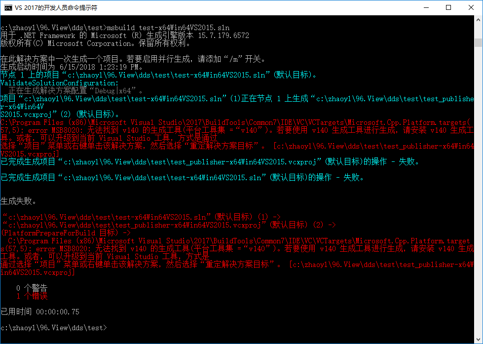
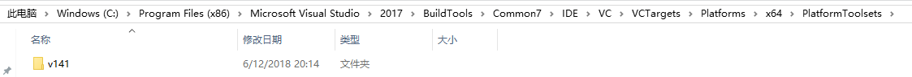
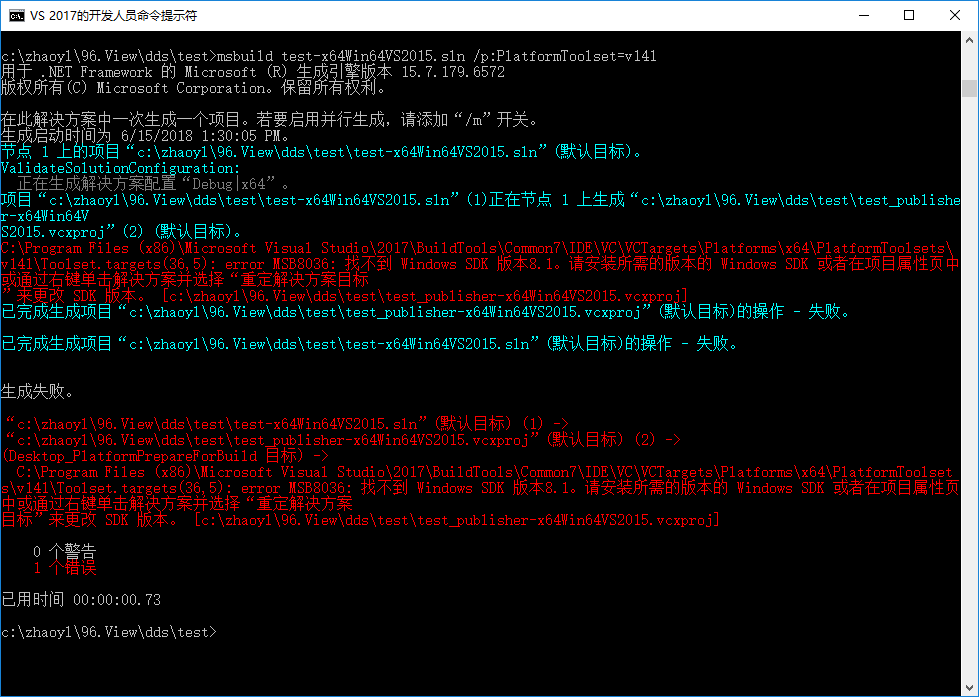
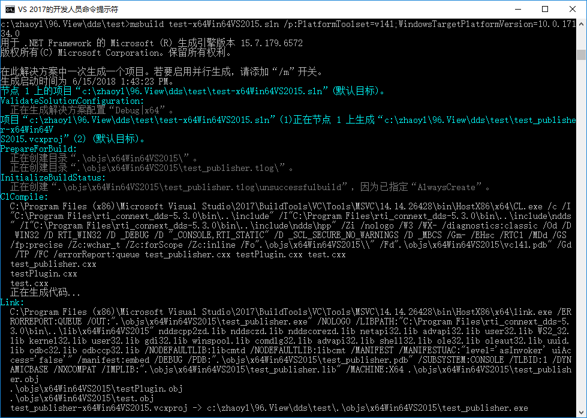
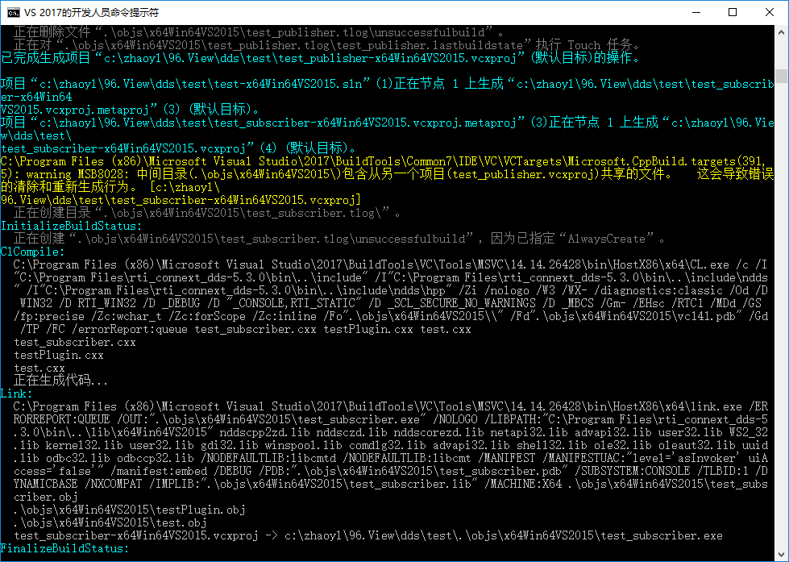
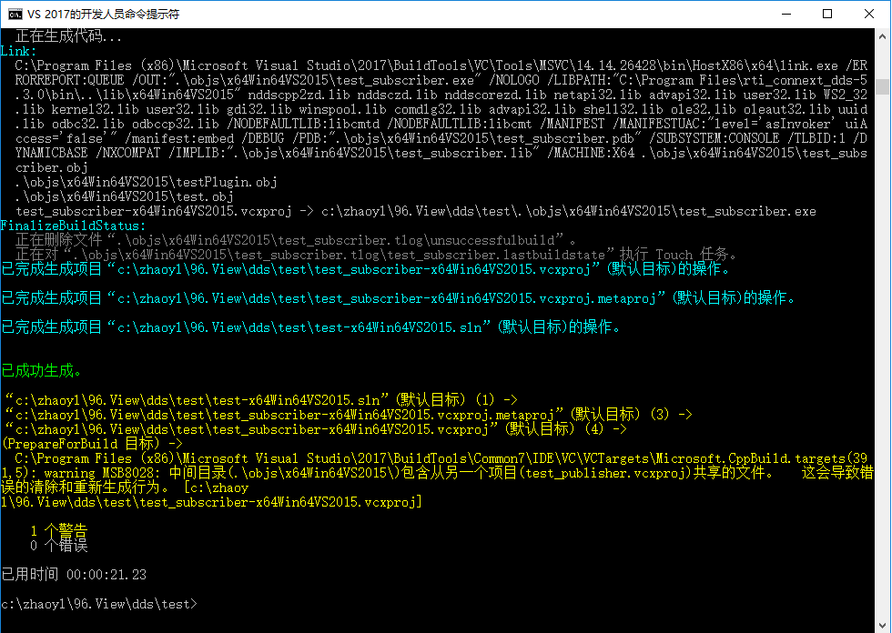

# Build VS2015 Project with VS2017 Build Tools

* Use MSBuild from VS2017 Build Tools to build VS2015 project, will Failed  
  

* Find the installed platform toolset and build again with it  
    
  Build again with the correct platfom toolset  
    
  We could see that it failed again, but failed at not correct SDK

* Find the installed Windows SDK  
    
  Build with correct Toolset and SDK  
    
    
    