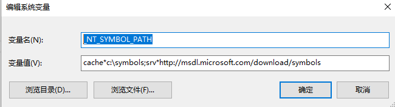
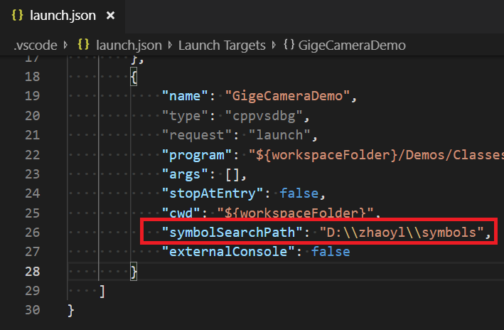

# Debug with PDB Symbols

## References

* https://github.com/Microsoft/vscode-cpptools/issues/248
* https://github.com/microsoft/vscode-cpptools
* https://docs.microsoft.com/en-us/windows/win32/dxtecharts/debugging-with-symbols
